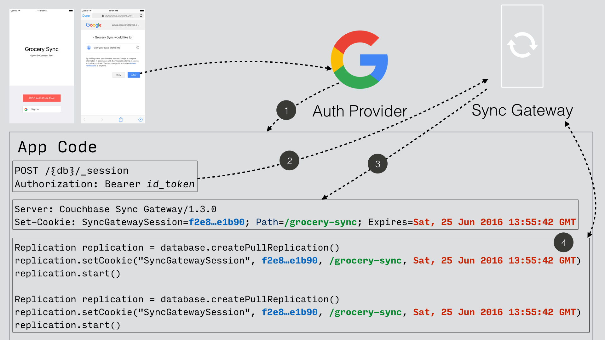

# OpenID\_connect\_tutorial

The goal of this tutorial is to help setting quickly the different components (CB Server, Sync Gateway, CB-Lite (Java) code and the third party Identity Provider) and establish an implicit flow authentication using the OpenID Connect protocol.

The source code of this tutorial is mainly derived from the [Getting Started App](https://docs.couchbase.com/couchbase-lite/2.7/java-platform.html#building-a-getting-started-app)

## OpenID connection workflow

The tutorial will achieve to deploy and make collaborate all those differents components :

Note : KeyCloak (KC) has been chosen as the Identity Provider to work with because it is well-known, Red hat supported, and of course because I like it 😄

## Deployment
Three docker containers wil be deployed :
 - 1 one-node Couchbase Server 6.5 instance
 - 1 Sync Gateway 2.7 instance
 - 1 Keycloak instance

 1 same network workshop2 will be used across all the docker containers.

 In addition, a CBLite Java (folder CBLite_code) project will be run on the host machine to simulate a CBLite client (App code).

### Deploying Keycloak (KC)

<code>docker run -p "8080:8080" --name keycloak --network workshop2  -e KEYCLOAK_USER=admin -e KEYCLOAK_PASSWORD=password jboss/keycloak</code>

<b>Note : to be improved as no volumes are mapped here (every configuration done is lost after stopping the container).</b>

### Deploying Couchbase Server 6.5
<code>docker run -d --name cb-server --network workshop2 -p 8091-8094:8091-8094 -p 11210:11210 couchbase/server-sandbox:6.5.0</code>

### Deploying Sync Gateway 2.7
<code>docker run -p 4984-4985:4984-4985 --network workshop2 --name sync-gateway -d -v `pwd`/sync-gateway-config-travelsample.json:/etc/sync_gateway/sync_gateway.json couchbase/sync-gateway:2.7.0-enterprise -adminInterface :4985 /etc/sync_gateway/sync_gateway.json</code>

## Internal DNS modification for the Sync Gateway
As we will see, at some point, the Sync Gateway needs to check the <code>id_token</code> against the issuer of the token (the Identity Manager KC). As a consequence, the FQDN of KC has to be found at SG level.
To do so, the docker FQDN name "keycloak" has to be accessible from the Sync Gateway (which is not the case by default). To overcome this issue, we retrieve the local IP address of KC (using docker inspect) and hard-code it inside the /etc/hosts of the SyncGateway. Again, if the container is stopped, this configuration is lost and has to be re-done.

## Sync gateway configuration file
A example of the Sync gateway configuration file using OpenID Connect option can be found in the folder SG_sync_file. The default 'travel-sample' bucket will be used for this tutorial.

Note (for me) : TO BE CHANGED to a new lighter bucket (called "stime"). Provide some data samples to populate this new bucket.

## Explanations
TBD

### Keycloak configuration
TBD

### CBLite app code - step 1 : access login page 
TBD

### CBLite app code - step 2 : submit credentials and get the id_token 
TBD

### CBLite app code - step 3 : store id_token in session (at SG level)
TBD

### Define roles (channels) to those new users (using SG REST Admin calls)
TBD

## Questions ?
TBD

